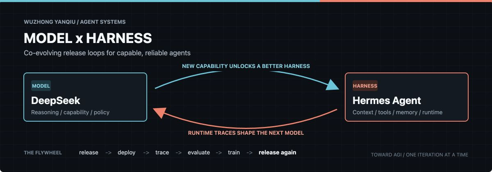

<div align="center">



# Wuzhong Yanqiu

**Exploring how models and agent harnesses learn to evolve together.**

[](https://github.com/deepseek-ai)
[](https://github.com/NousResearch/hermes-agent)


</div>

## My thesis

The model is only half of an agent system.

As model releases accelerate, each model will increasingly need a harness shaped
around its own capabilities: the right context strategy, tools, memory, permissions,
and recovery mechanisms. In return, the harness produces real trajectories and
failure signals that improve evaluation, training data, and the next model release.

> **Models raise the capability ceiling. Harnesses determine how much of it becomes real.**

This is the loop I care about: model and harness releases accelerating one another,
step after step, toward agents that are genuinely capable, reliable, and adaptive.

## What I follow

| Direction | Focus |
| --- | --- |
| **DeepSeek Harness** | Turning new reasoning and coding capabilities into reliable agent behavior |
| **Hermes Agent** | Tool use, user-aligned memory, autonomous operation, and an agent that grows over time |
| **Agent Training** | Trajectory collection, feedback signals, data curation, post-training, and self-improvement |
| **Evaluation** | Process traces, reproducible tasks, quality gates, regression detection, and observability |

## The co-evolution loop

```text
model release
    -> capability discovery
        -> harness adaptation
            -> real-world deployment
                -> trajectories + failures
                    -> evaluation + training data
                        -> next model release
```

I am especially interested in the interfaces between these stages. Better interfaces
make iteration faster; faster iteration makes the entire system learn.

## Questions worth answering

- What should be inside a model-specific harness, and what should remain universal?
- Which runtime traces are useful enough to become evaluation or training data?
- How do we measure the capability unlocked by a harness, not just the base model?
- Can memory remain useful, inspectable, and controllable as an agent grows?
- How quickly can a model release and its harness release converge into one loop?

## Working principles

```text
Capability needs a runtime.
Autonomy needs observability.
Experience needs to become data.
Every release should improve the next release.
```

<details>
<summary><strong>中文 / 核心判断</strong></summary>

我主要关注 DeepSeek Harness、Hermes Agent、Agent Training 与过程评测。

我认为，未来每个模型都会逐渐形成适合自身能力特点的 Harness。模型不断发版，带来新的推理、编码和工具使用能力；Harness 随之快速适配，把能力转化为真实任务中的可靠表现。同时，Harness 在运行中产生的轨迹、失败案例和反馈信号，又会进入评测与训练闭环，推动下一轮模型迭代。

模型决定能力上限，Harness 决定能力兑现率。两者相互加速、交替前进，才能让 Agent 从一次性的聪明演示，走向持续运行、持续学习、持续进化的系统，并最终接近真正的 AGI。

</details>

---

<div align="center">

`MODEL RELEASE` &nbsp; x &nbsp; `HARNESS RELEASE` &nbsp; x &nbsp; `REAL-WORLD FEEDBACK`

</div>
