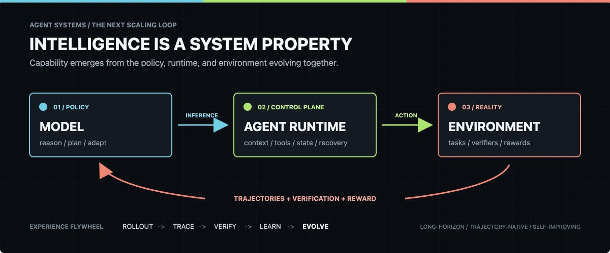

<div align="center">



# Wuzhong Yanqiu

**Exploring the runtime and learning systems behind long-horizon agents.**


</div>

## The thesis

The next scaling loop for agents will not be model-only.

Intelligence in the real world is a property of the complete system: a **policy**
that reasons, a **runtime** that controls context and action, and an **environment**
that returns verifiable feedback. Improving any one layer changes what the other
two can learn.

> **The checkpoint provides latent capability. The runtime turns it into behavior. Experience turns behavior into the next release.**

The release unit is shifting from a model checkpoint to an evolving system:
policy weights, harness, tools, context strategy, verifiers, and evaluation packs.

## Frontier map

| Direction | What matters |
| --- | --- |
| **Agent Runtime / Control Plane** | Execution loops, scoped tools, durable state, permissions, recovery, and intervention |
| **Context Engineering** | Selection, compaction, memory views, context resets, skill retrieval, and attention budgets |
| **Long-Horizon Reliability** | Checkpointing, resumability, failure attribution, handoffs, and completion evidence |
| **Trajectory-Native Learning** | Rollouts, step-level signals, credit assignment, experience replay, and agentic RL |
| **Verifiable Environments** | Executable feedback, process rewards, regression gates, and task-grounded evaluation |
| **Harness Evolution** | Automatically testing and improving tools, middleware, memory, prompts, and runtime policy |

## The experience flywheel

```text
release the system
    -> run real tasks
        -> capture trajectories
            -> attribute failures
                -> verify outcomes
                    -> update weights or harness
                        -> release the next system
```

The most valuable artifact is no longer just the final answer. It is the full,
auditable episode: state, action, tool result, reward, failure, recovery, and proof
of completion.

## Working hypotheses

```text
System capability > checkpoint capability
Context is a runtime resource, not a static prompt
Production experience becomes training substrate
Evaluation moves inside the execution loop
The harness becomes a learnable policy surface
```

## Questions worth answering

- What belongs in a model-specific runtime, and what should remain universal?
- When should experience update model weights, and when should it evolve the harness?
- How do we preserve state and coherence across hours, days, and context resets?
- Which verifiers can turn ambiguous work into trustworthy learning signals?
- Can an evolution control plane improve agents without losing observability or control?

<details>
<summary><strong>中文 / 核心判断</strong></summary>

我关注的不只是某个模型或某个 Agent 产品，而是 **Model × Runtime × Environment** 组成的完整智能系统。

未来发布的基本单位不会只是一个模型 checkpoint，而会是一整套协同演化的系统：模型权重、Agent Runtime、上下文策略、工具与权限、长期状态、可验证环境以及评测包。模型提升能力上限，Runtime 把潜在能力兑现成可靠行为；真实任务产生的轨迹、失败归因和验证信号，再分别推动模型训练与 Harness 演化。

模型升级会让 Runtime 更轻、更强，Runtime 升级又会产生更高质量的经验与训练信号。两者交替加速，再由环境提供可验证的现实反馈，形成真正能够持续学习的 Experience Flywheel。这是我认为通向长程自主系统乃至 AGI 的关键路径。

</details>

---

<div align="center">

`POLICY` &nbsp; x &nbsp; `RUNTIME` &nbsp; x &nbsp; `ENVIRONMENT` &nbsp; -> &nbsp; `EVOLUTION`

</div>
